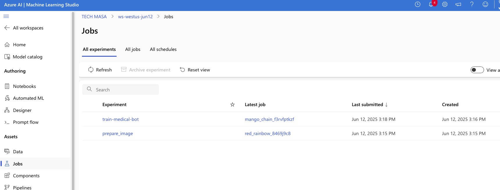

# 🧠 Azure ML TinyLlama Fine-Tuning Project

This is a hands-on mini project demonstrating how to run a TinyLlama 1.1B fine-tuning job on Azure Machine Learning from a Mac mini (M4 Pro).

## ✅ Highlights

- ✅ Built a real Azure ML pipeline from scratch
- ✅ Used CLI tools (`az`, `az ml`)
- ✅ Created and used `environment.yml` and `train_job.yml`
- ✅ Deployed a GPU training job using `Standard_NC4as_T4_v3`
- ✅ Learned job tracking, environment management, and workspace setup
- ✅ Controlled cost by avoiding unnecessary GPU inference
- ✅ Saved model output for local testing

## 💻 Files

- `Train_TinyLlama-1.1B-Chat-v1.0.py` — LoRA fine-tuning script
- `environment.yml` — Conda environment for Azure ML
- `train_job.yml` — Azure ML job definition

## 🧭 Usage (CLI)

To run this project on Azure ML:

```bash
az ml job create \
  --file train_job.yml \
  --resource-group <your-resource-group> \
  --workspace-name <your-workspace-name>

## 📷 Screenshots 

### ✅ Job Status Dashboard  


### ✅ Output + Logs Tab  


### ✅ Successful GPU Cluster Execution  

