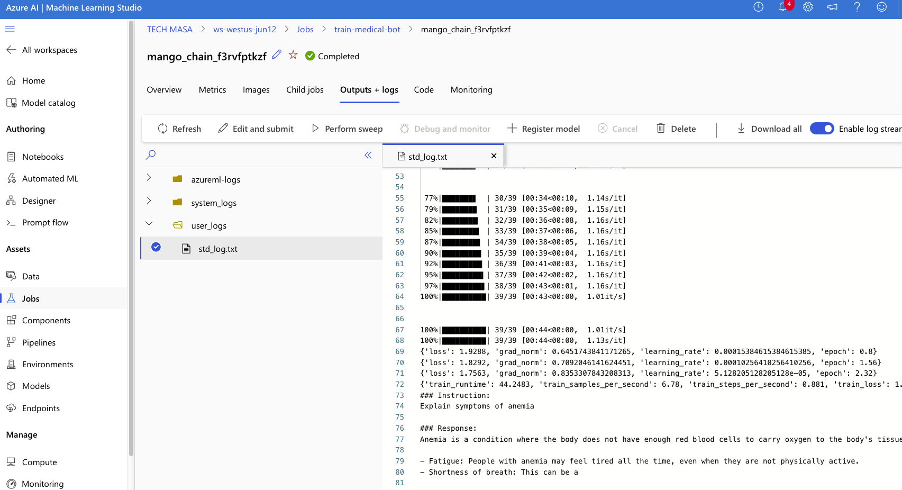
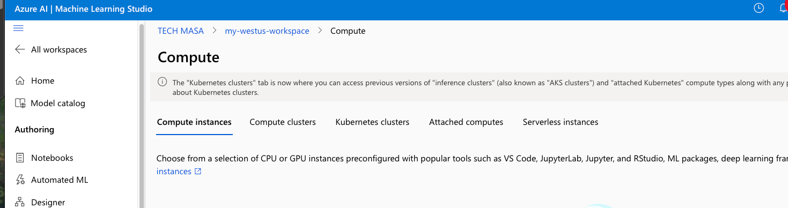

# azureml-tinyllama-finetune

Running TinyLlama fine-tuning job on Azure ML from a Mac mini (M4 Pro).  
This mini project demonstrates a real-world GPU training workflow using Azure Machine Learning CLI.

## ✅ Highlights

- Full Azure ML pipeline from scratch
- Used `az ml` CLI for training job submission
- Created `environment.yml` and `train_job.yml`
- Ran training with GPU cluster (Standard_NC4as_T4_v3)
- Tracked training progress in Azure ML Studio
- Uploaded screenshots from Azure ML UI
- Saved model output for local inference
- Handled errors, permissions, and cloud cost awareness

## 📁 Files

- `Train_TinyLlama-1.1B-Chat-v1.0.py`: LoRA training script
- `environment.yml`: Conda environment for Azure ML
- `train_job.yml`: Job submission file for CLI
- `screenshots/`: Azure ML Studio screenshots (job, logs, cluster)

## 📷 Screenshots

  
  

